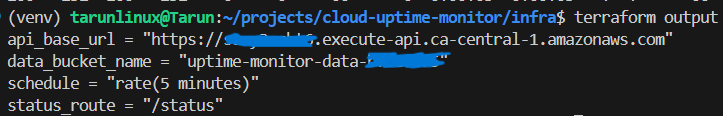
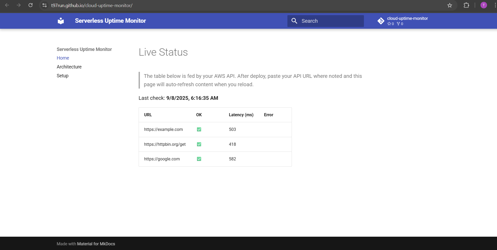
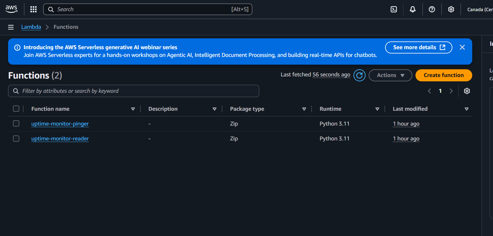
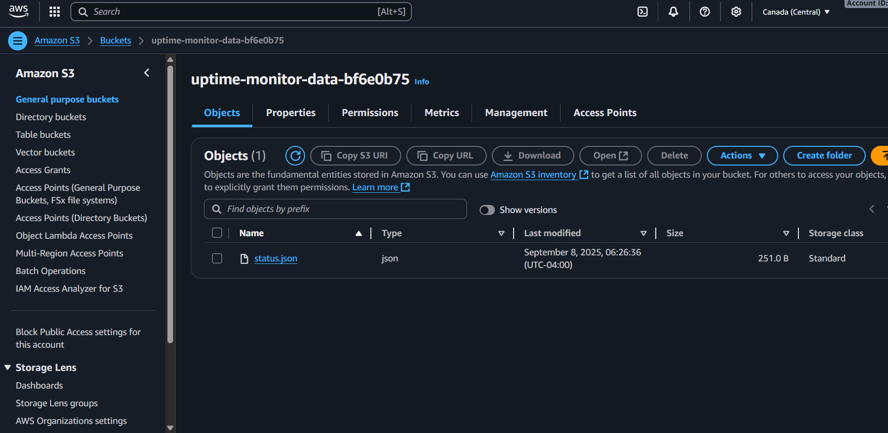
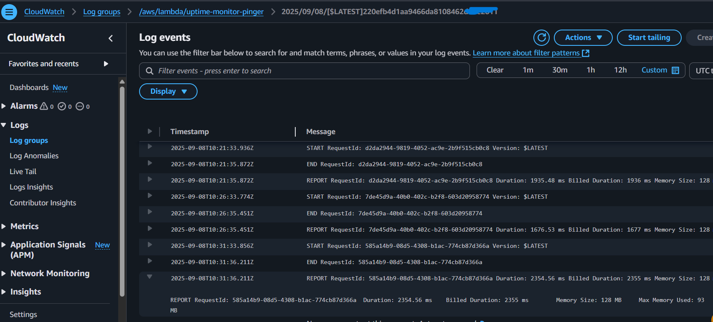

# Live Status (Archived)

!!! warning "Live API turned off"
    To avoid ongoing AWS charges, the live endpoint has been decommissioned.  
    Below are screenshots captured while the system was running.

## Screenshots

**Terraform Outputs**

**MkDocs live status page**

**Lambda functions**

**API Gateway route**

**S3 status object**

**CloudWatch Logs**

---
<!--

# Live Status

> The table below is fed by your AWS API. After deploy, paste your API URL where noted and this page will auto-refresh content when you reload.

Loading…

-->